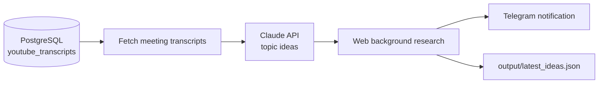

# Claude LLM Local News Analysis

Analyze YouTube meeting transcripts from PostgreSQL, use **Claude** to suggest video topic ideas, run background web research, and deliver summaries via **Telegram**.

## Pipeline



## Quick start

### 1. Install dependencies

```bash
pip install -r requirements.txt
```

### 2. Start PostgreSQL (local dev)

```bash
docker compose up -d
```

This creates the `youtube_transcripts` database with schema and sample meeting data.

### 3. Configure environment

```bash
cp .env.example .env
```

| Variable | Required | Description |
|----------|----------|-------------|
| `DATABASE_URL` | Yes | PostgreSQL connection string |
| `ANTHROPIC_API_KEY` | One of | Direct Claude API key (preferred) |
| `OPENROUTER_API_KEY` | One of | Claude via OpenRouter |
| `OPENAI_API_KEY` | One of | Fallback if Claude providers unavailable |
| `CLAUDE_MODEL` | No | Default: `claude-sonnet-4-5` (OpenRouter: `anthropic/claude-sonnet-4.5`) |
| `TELEGRAM_BOT_TOKEN` | For notifications | From [@BotFather](https://t.me/BotFather) |
| `TELEGRAM_CHAT_ID` | For notifications | Your chat or group ID |
| `LOOKBACK_DAYS` | No | How far back to fetch meetings (default 14) |
| `MAX_TRANSCRIPTS` | No | Max transcripts per run (default 10) |

### 4. Run the pipeline

```bash
python run_pipeline.py
```

Preview without sending Telegram:

```bash
python run_pipeline.py --dry-run
```

### 5. Web dashboard

Start the dashboard to test Telegram, edit AI guidance, and preview generated ideas:

```bash
python run_dashboard.py
```

Open [http://localhost:8080](http://localhost:8080)

On **Railway**, the app reads the `PORT` environment variable automatically. The start command is configured in `railway.toml`:

```bash
uvicorn src.api.app:app --host 0.0.0.0 --port $PORT
```

Make sure your Railway service **start command** runs the dashboard (not `run_pipeline.py`). Health check: `/api/health`.

Dashboard features:

- Connection status for database, LLM, and Telegram
- Send a Telegram test message
- Save producer guidance that is injected into the Claude system prompt (persisted in PostgreSQL)
- Run analysis and preview ideas without leaving the browser

## Database schema

Tables: `channels`, `videos`, `transcripts`, `analysis_runs`.

Mark videos as meetings with `is_meeting = TRUE`. Transcripts live in `transcripts.full_text`.

```sql
INSERT INTO videos (video_id, title, is_meeting, meeting_type, published_at)
VALUES ('abc123', 'County Commissioners - Jan 2025', TRUE, 'county_commission', NOW());

INSERT INTO transcripts (video_id, full_text)
VALUES (
  (SELECT id FROM videos WHERE video_id = 'abc123'),
  'Full transcript text here...'
);
```

## Daily automation

When the dashboard is running (`python run_dashboard.py` or Railway deploy), it automatically:

1. **Scans daily** for new meeting transcripts not yet analyzed
2. **Runs analysis + Telegram notification** when new meetings are found
3. **Listens on Telegram** for on-demand requests about the latest meeting

Configure in `.env`:

| Variable | Default | Description |
|----------|---------|-------------|
| `DAILY_SCAN_ENABLED` | `true` | Enable daily scan scheduler |
| `DAILY_SCAN_HOUR` | `8` | Hour to run scan (24h) |
| `DAILY_SCAN_MINUTE` | `0` | Minute to run scan |
| `DAILY_SCAN_TIMEZONE` | `UTC` | Timezone for schedule |
| `TELEGRAM_POLLING_ENABLED` | `true` | Listen for Telegram commands |

Manual scan:

```bash
python run_daily_scan.py
# or
curl -X POST http://localhost:8080/api/scan/daily
```

### Telegram commands

Message your bot (from the configured `TELEGRAM_CHAT_ID`):

- `/latest` or `/ideas` — full video ideas analysis for the latest meeting
- `/reset` — clear conversation memory
- `/help` — show commands

**Ask questions naturally** — the bot acts as an AI agent using latest meeting transcripts:

- *What was the most controversial vote in the latest meeting?*
- *Summarize the school board budget discussion*
- *Give me 3 video angles on the downtown development item*
- *Who spoke against the bond measure?*

Processed meetings are tracked in `processed_transcripts` so daily scans only notify you about **new** meetings.

## Scheduling (optional external cron)

If you prefer an external cron instead of the built-in scheduler, disable `DAILY_SCAN_ENABLED` and run:

```cron
0 8 * * * cd /path/to/repo && /path/to/venv/bin/python run_daily_scan.py
```

## Output

- **Telegram**: HTML-formatted summary with titles, hooks, key points, and research snippets
- **JSON**: `output/latest_ideas.json` with full structured ideas and research results
- **Database**: `analysis_runs` table records each execution

## Project layout

```
config/
  ai_guidance.json    # Saved AI producer guidance
db/
  schema.sql          # PostgreSQL schema
  seed.sql            # Sample meeting data
frontend/
  index.html          # Web dashboard UI
src/
  api/                # FastAPI routes
  config.py           # Environment settings
  db/transcripts.py   # Transcript queries
  llm/claude.py       # Claude analysis
  services/           # Pipeline + prompt settings
  research/web_search.py
  notifications/telegram.py
run_pipeline.py       # CLI entry point
run_dashboard.py      # Web dashboard server
```
